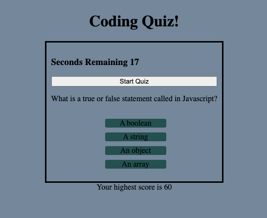
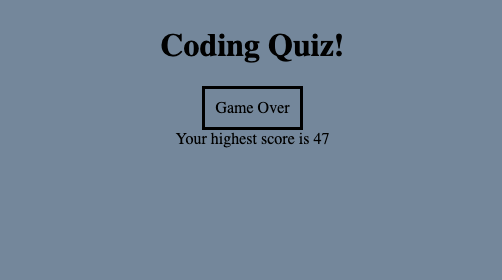

# Coding-Quiz

## Description
For this project I created a very simple coding quiz. It consists of four questions that the user must answer before the timer reaches 0. For every wrong answer, 10 secounds is deducted from the clock. At the end, the highest score is logged.
--
## Demo
 

--
## Challenges
I found this project extremly challenging, and there are still a few bugs that I was unable to work out. For instance, the second to the last question is skipped, so only three questions end up being displayed. I also had a lof of issues with the styling and getting things to line up how I wanted them to.
-- 
## Deployed Website
https://kirmarnel.github.io/Coding-Quiz/ 

